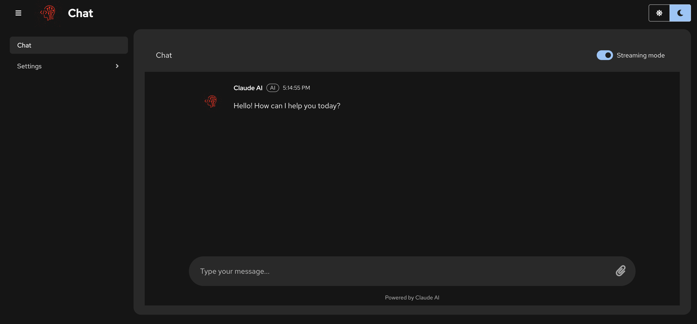

# Chatbot

[](https://opensource.org/licenses/Apache-2.0)
[](https://www.python.org/downloads/)
[](https://nodejs.org/)
[](https://fastapi.tiangolo.com/)
[](https://reactjs.org/)

A full-stack AI chatbot application with React frontend (Vite) using PatternFly and FastAPI backend, featuring LiteLLM integration for multiple LLM providers (OpenAI, Anthropic Claude, Google Gemini, and OpenAI-compatible endpoints) with MCP (Model Context Protocol) support. Ready for deployment to OpenShift.



## Table of Contents

- [Features](#features)
- [Architecture](#architecture)
- [Quick Start](#quick-start)
- [Project Structure](#project-structure)
- [Configuration](#configuration)
- [API Endpoints](#api-endpoints)
- [MCP Integration](#mcp-integration)
- [Deployment](#deployment)
- [Development](#development)
- [Testing](#testing)
- [Troubleshooting](#troubleshooting)
- [License](#license)

## Features

- 🤖 **Multi-LLM Support**: Powered by LiteLLM with support for OpenAI GPT, Anthropic Claude, Google Gemini, and OpenAI-compatible endpoints (vLLM, LocalAI)
- 🔧 **MCP Support**: Extend LLMs with custom tools via Model Context Protocol
- 🎨 **Modern UI**: React with TypeScript, Vite, and PatternFly components
- 🌙 **Dark Mode**: Built-in theme toggle with dark mode as default
- 🚀 **Production Ready**: Containerized with Docker and OpenShift deployment
- 📦 **Fast Dependencies**: Backend uses UV for lightning-fast Python package management
- 🔒 **Security**: OpenShift Security Context Constraints (SCC) compatible
- 📊 **Monitoring**: Health checks and resource monitoring
- 🎯 **Environment-Specific**: Dev/prod configurations with Kustomize

## Architecture

- **Frontend**: React with TypeScript and Vite - Modern chat interface with PatternFly
- **Backend**: FastAPI with Python - AI chat API with LiteLLM integration
- **AI Integration**: LiteLLM unified interface supporting OpenAI, Claude, Gemini, and OpenAI-compatible endpoints
- **Package Management**: UV for Python (fast), npm for Node.js
- **Containerization**: Docker multi-stage builds for optimal size
- **Deployment**: OpenShift with Kustomize for environment-specific configurations
- **Container Registry**: Quay.io for image storage
- **API Routing**: Vite proxy for local development, Nginx proxy for production

## Quick Start

### Prerequisites

- **Node.js** 22+ ([Download](https://nodejs.org/))
- **Python** 3.11+ ([Download](https://www.python.org/downloads/))
- **UV** Python package manager ([Install](https://docs.astral.sh/uv/))
- **Docker** ([Install](https://docs.docker.com/get-docker/))
- **OpenShift CLI** (`oc`) for deployment ([Install](https://docs.openshift.com/container-platform/4.14/cli_reference/openshift_cli/getting-started-cli.html))
- **Kustomize** for Kubernetes manifests ([Install](https://kubectl.docs.kubernetes.io/installation/kustomize/))

### Local Development

1. **Clone and setup**:
   ```bash
   git clone https://github.com/cfchase/chatbot
   cd chatbot
   
   # Setup all dependencies and environment files
   make setup
   make env-setup
   ```

2. **Configure API keys**:
   ```bash
   # Edit backend/.env with your LLM provider API key
   vim backend/.env
   # Set API_KEY and MODEL (defaults to OpenAI gpt-3.5-turbo)
   ```

3. **Run locally**:
   ```bash
   # Run both frontend and backend
   make dev
   
   # Or run separately
   make dev-backend   # Backend on http://localhost:8000
   make dev-frontend  # Frontend on http://localhost:8080
   ```

4. **Access the application**:
   - Frontend: http://localhost:8080
   - Backend API: http://localhost:8000
   - Health check: http://localhost:8000/api/health

## Project Structure

```
├── backend/                    # FastAPI backend
│   ├── app/                   # Application code
│   │   ├── api/              # API routes
│   │   ├── models/           # Data models
│   │   └── services/         # Business logic (Claude, MCP)
│   ├── docs/                 # Backend documentation
│   ├── tests/                # Test files
│   ├── main.py               # FastAPI application entry point
│   ├── pyproject.toml        # Python dependencies (UV)
│   ├── uv.lock              # Locked dependency versions
│   ├── mcp-config.example.json # MCP server configuration example
│   └── Dockerfile           # Backend container
├── frontend/                 # React frontend
│   ├── src/                 # Source code
│   │   ├── app/            # React components
│   │   │   ├── Chat/       # Chat interface
│   │   │   ├── Settings/   # Settings pages
│   │   │   └── contexts/   # React contexts (Theme)
│   │   └── favicon.png     # Custom AI logo favicon
│   ├── package.json        # Node.js dependencies
│   ├── vite.config.ts     # Vite configuration
│   ├── nginx.conf         # Production Nginx config
│   └── Dockerfile         # Frontend container
├── k8s/                    # Kubernetes/OpenShift manifests
│   ├── base/              # Base kustomize resources
│   └── overlays/          # Environment-specific configs
│       ├── dev/          # Development environment
│       └── prod/         # Production environment
├── scripts/               # Deployment automation
├── docs/                  # Documentation and screenshots
├── Makefile              # Development commands
└── package.json          # Root npm scripts
```

## Configuration

### Environment Setup

Use the provided make targets to set up your environment:

```bash
# Copy example files for local development
make env-setup

# Copy example files for Kubernetes deployment
make env-setup-k8s
```

### Backend Configuration

Edit `backend/.env` (created from `.env.example`):

```env
# LLM Configuration (via LiteLLM)
API_KEY=your-api-key-here
MODEL=gpt-3.5-turbo  # Default: OpenAI

# Optional: Use different providers
# MODEL=claude-3-sonnet-20240229  # Anthropic Claude
# MODEL=gemini/gemini-pro         # Google Gemini

# Optional: Use OpenAI-compatible endpoints (vLLM, LocalAI)
# API_BASE_URL=http://localhost:8000/v1
# PROVIDER=openai
```

### Frontend Configuration

Edit `frontend/.env` (created from `.env.example`):

```env
VITE_API_URL=http://localhost:8000
```

### MCP Configuration (Optional)

Create `backend/mcp-config.json` to add custom tools:

```json
{
  "mcpServers": {
    "filesystem": {
      "command": "npx",
      "args": ["-y", "@modelcontextprotocol/server-filesystem", "/path/to/allowed/files"]
    },
    "calculator": {
      "command": "python",
      "args": ["path/to/your/calculator_server.py"]
    }
  }
}
```

## API Endpoints

The backend provides the following REST API endpoints:

- `GET /` - Root endpoint with API information
- `GET /api/v1/utils/health-check` - Health check endpoint
- `POST /api/v1/chat/` - Chat with LLM (supports MCP tools)
- `GET /api/v1/chat/mcp/tools` - List available MCP tools

## MCP Integration

This chatbot includes MCP (Model Context Protocol) support, allowing you to extend your LLM's capabilities with custom tools from MCP servers. MCP enables:

- **Custom Tools**: Add domain-specific tools that your LLM can use
- **External Integrations**: Connect to databases, APIs, or local services  
- **Flexible Transports**: Support for stdio, HTTP, and WebSocket connections

### Documentation

- [MCP Setup Guide](backend/MCP_README.md) - Quick start guide for adding MCP servers
- [Technical Documentation](backend/docs/MCP_INTEGRATION.md) - Detailed architecture and implementation
- [API Reference](backend/docs/MCP_API.md) - Complete API documentation

### Quick Example

Create a simple MCP server (`calculator.py`):

```python
from fastmcp import FastMCP

mcp = FastMCP("calculator")

@mcp.tool()
def add(a: float, b: float) -> float:
    """Add two numbers"""
    return a + b

if __name__ == "__main__":
    mcp.run()
```

Add to `backend/mcp-config.json` and your LLM will have access to your custom tools!

## Deployment

### Container Images

Build and push images to your registry:

```bash
# Build and push for development (uses latest tag)
make build && make push

# Build and push for production (uses prod tag)
make build-prod && make push-prod

# Explicit development commands
make build-dev && make push-dev

# Custom registry and tag
make build TAG=v1.0.0 REGISTRY=quay.io/yourorg
make push TAG=v1.0.0 REGISTRY=quay.io/yourorg
```

### OpenShift Deployment

1. **Setup configuration**:
   ```bash
   # Copy and edit Kubernetes environment files
   make env-setup-k8s
   
   # Edit k8s/overlays/deploy/.env
   # Add your LLM provider API key
   ```

2. **Login to OpenShift**:
   ```bash
   oc login --server=https://your-openshift-cluster
   ```

3. **Deploy to OpenShift**:
   ```bash
   # Build, push, and deploy
   make build && make push && make deploy
   ```

4. **Manage deployment**:
   ```bash
   make kustomize       # Preview manifests
   make undeploy        # Remove deployment
   ```

## Development

### Available Commands

```bash
# Setup
make setup           # Install all dependencies
make env-setup       # Setup environment files
make fresh-start     # Clean setup for new development

# Development
make dev             # Run both frontend and backend
make dev-frontend    # Run frontend only (port 8080)
make dev-backend     # Run backend only (port 8000)

# Building
make build           # Build frontend and container images (alias for build-dev)
make build-dev       # Build frontend and container images for development
make build-prod      # Build frontend and container images for production
make build-frontend  # Build frontend only

# Pushing
make push            # Push development images (alias for push-dev)
make push-dev        # Push development images to registry
make push-prod       # Push production images to registry

# Deployment
make deploy          # Deploy to development (alias for deploy-dev)
make deploy-dev      # Deploy to development environment
make deploy-prod     # Deploy to production environment

# Health checks
make health-backend  # Check backend health
make health-frontend # Check frontend health

# Cleanup
make clean           # Clean build artifacts
make clean-all       # Clean everything
```

## Testing

### Run Tests

```bash
# Run all tests
make test

# Run specific tests
make test-frontend        # Frontend tests
make test-backend         # Backend tests  
make test-backend-verbose # Backend tests with verbose output

# Linting
make lint                 # Run frontend linting
```

### Test Structure

- **Frontend**: Jest and React Testing Library
- **Backend**: pytest with comprehensive MCP integration tests
- **E2E**: Tests for chat functionality and MCP tool integration

## Troubleshooting

### Common Issues

1. **MCP servers not starting**:
   - Check Node.js is installed in container
   - Verify MCP config file format
   - Check server permissions and paths

2. **Memory issues in OpenShift**:
   - Backend has been configured with 2Gi memory limit
   - Increase if running many MCP servers

3. **API key issues**:
   - Ensure API_KEY is set correctly in backend/.env
   - Check API key permissions and usage limits for your provider
   - Verify MODEL matches your provider (e.g., gpt-3.5-turbo for OpenAI)

4. **Build failures**:
   - Run `make clean` before rebuilding
   - Check Docker daemon is running
   - Verify image registry permissions

### Getting Help

- Check the [MCP documentation](backend/docs/) for integration issues
- Review OpenShift logs: `oc logs -f deployment/backend`
- Test API endpoints directly: `curl http://localhost:8000/api/health`

## License

Apache License 2.0 - see [LICENSE](LICENSE) file for details.